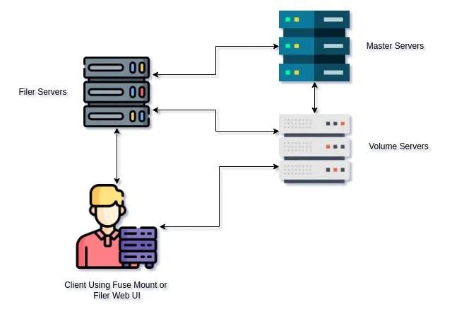

# Guide to SeaweedFS and Minio CLI on GKE



Image ref: [Seaweedfs Distributed Storage Part 1: Introduction. | by Ali Hussein Safar | Medium](https://medium.com/@ahsifer/seaweedfs-25640728775c)

## Prerequisites

Before you begin, ensure you have the following tools and access set up:

- **Google Cloud Project**: A GCP project with billing enabled
- **GKE Cluster**: An active Google Kubernetes Engine cluster
- **kubectl**: Kubernetes command-line tool configured to access your GKE cluster
    - Installation: [Install kubectl](https://kubernetes.io/docs/tasks/tools/)
- **Helm**: Package manager for Kubernetes (version 3.x recommended)
    - Installation: [Install Helm](https://helm.sh/docs/intro/install/)
- **Docker**: For running the Minio CLI container
    - Installation: [Install Docker](https://docs.docker.com/get-docker/)
- **Git**: For cloning the repository
    - Installation: [Install Git](https://git-scm.com/book/en/v2/Getting-Started-Installing-Git)

### Cluster Access Verification

Verify you have proper access to your GKE cluster:

```bash
kubectl cluster-info
kubectl auth can-i create namespaces

```

## Deploying SeaweedFS on GKE via Helm Chart

Noted: Assuming you’re connected to the kubernetes cluster

1. **Git Clone** 

```hcl
git clone https://github.com/GGital/SeaweedFS-GKE-manual.git
```

2. **Setup Helm repository**

```hcl
helm repo add seaweedfs https://seaweedfs.github.io/seaweedfs/helm
helm repo update
```

3. **Deploying to cluster**

```hcl
kubectl create namespace seaweedfs
kubectl apply -f lb-svc
helm install my-seaweed seaweedfs/seaweedfs -n seaweedfs -f helm-value.yaml
```

### Expected Results

- **Pods in seaweedfs namespace**

```hcl
kubectl get pod -n seaweedfs
```


- **Services in seaweedfs namespace**

```hcl
kubectl get svc -n seaweedfs
```


- **PVC in seaweedfs namespace**

```hcl
kubectl get pvc -n seaweedfs
```


### References for more helm values

- https://artifacthub.io/packages/helm/seaweedfs/seaweedfs
- https://github.com/seaweedfs/seaweedfs/tree/master/k8s/charts/seaweedfs

## How to access services

1. **Get external-IP**

```hcl
kubectl get svc seaweedfs-filer-public seaweedfs-s3-public -n seaweedfs
```


- Services are accessible at load balancer’s external IP with the specified ports
    - **filer service**: http://< filer-lb-external-ip >:8888
    - **S3 API service**: http://< s3-lb-external-ip >:8333

### Expected Result

- **Filer service**


- **S3 API service**


## Connecting minio CLI to Seaweedfs S3 API

1. Running instance of minio CLI with docker

```hcl
docker run --rm -it --entrypoint=/bin/sh minio/mc

# You may mount the volume with -v to see downloaded file on local

# Example docker run --rm -it --entrypoint=/bin/sh -v /download:/data minio/mc
```

Now, the terminal will accept mc alias commands 


2. Setting alias to s3 api service

```hcl
mc alias set seaweed http://<s3-lb-external-ip>:8333 <ACCESS_KEY> <SECRET_KEY>

# Default ACCESS_KEY is admin, SECRET_KEY is adminpassword
```


## Testing integration of minio CLI and seaweedfs

 

| **Step** | **Command** | **What it tests** |
| --- | --- | --- |
| **1. Create Bucket** | `mc mb seaweed/test-bucket` | Write permission to the Filer metadata. |
| **2. Upload File** | `echo "hello seaweed" > test.txt` <br><br>`mc cp test.txt seaweed/test-bucket/` | Data transfer to Volume servers. |
| **3. List Files** | `mc ls seaweed/test-bucket/` | Metadata retrieval from the Filer. |
| **4. Download File** | `mc cp seaweed/test-bucket/test.txt ./test-download.txt` | Read path from Volume servers. |

### Expected Result

- Navigate into filer UI at http://<filer-lb-external-ip>:8888 and then go into directory `buckets > test-bucket`
- You must find the txt file called “test.txt” with the content “hello seaweed”

